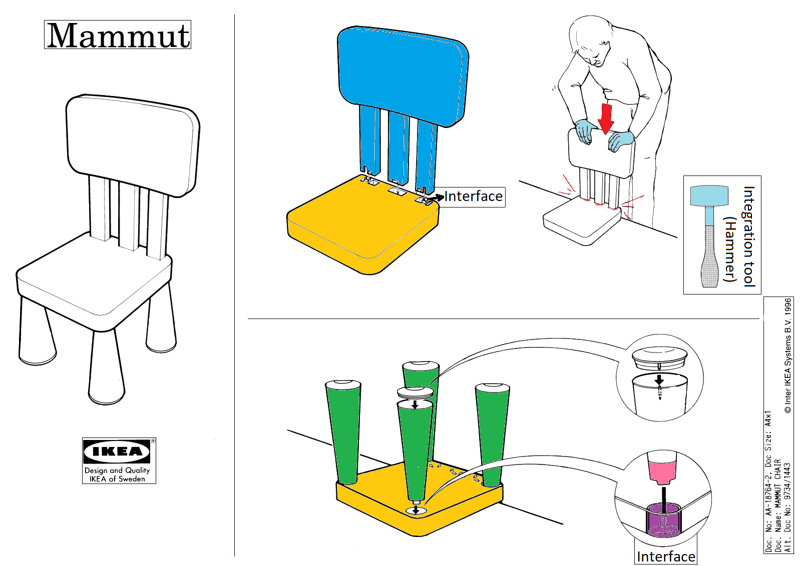

# General programming basics
## Introduction
Our new world is based on outsourcing certain tasks of our brain / mind. (Just think of a calculator.)  
That is why programming languages were constructed / invented / developed by creative engineers.  
They wanted to have the language best fitting to their personality by which they could build their dreams more efficiently. 
1. If you have something constructed in your brain(e.g. your dream app) or just want to try out how things work, 
or getting familiarized with what works and what not in a short amount of time,
2. If you want to learn in fields of sciences where your time is more valuable than the performance of your code,
3. If you're just want to learn some programming basics,  
then Python is the best choice for your learning path.

Before we start actual programming, I want to stick a kind of programming mindset into your brain 
which can help to avoid several weeks or even months of headache in the topics.  
Every important definition and phrase that are essential are marked with **bold letters** in the text.  
These are the most important principles in the IT field.

## Programming language types
There are [many way](https://softwareengineering.stackexchange.com/questions/17976/how-many-types-of-programming-languages-are-there) you can group programming languages by. 
You can think of these groups like *different ways of thinking or approaches to solving problems*.  
Two categories into which Python can be classified:

### 1. **Script** programming languages  
   When you are thinking roughly in your life, sometimes you don't want to go into every detail, You only want to stay "high".  
   That is what you can do with script languages. Script languages use a so-called **high-level** approach. 
   Here, you don't have to focus on details, you only need to focus on performing the appropriate task necessary for your purpose.  
   
   There are many **libraries** and **packages** related to these languages. These contain useful tools for your development.
   For example, if you want to build a chair, you don't want to develop a hammer, a saw, different nails, etc. to see that you are able to do that. 
   Just want to use these tools to support your work. That is, why you will **import** e.g. a package called "Workshop" which contains your tools.
   After you hire an entire workshop it is much easier to build a chair from scratch.

   Python is a script language. In it, importing this workshop look like this:
   ```python
    import Workshop
   ```
   After this line above you are ready to go with your workshop.
   
### 2. Object-Oriented Programming (OOP) languages
Every problem can be broken down according to Object-Oriented Programming. This is a really similar way to our thinking.
In OOP languages, problems, like building a chair are broken down into little pieces called **objects**.  
After starting the task of building a chair, you will immediately notice you have to make 4 `legs`, 1 `seating area`, and a `backrest`.  

These are the **objects** of your problem in OOP. You may have to make 10 chairs by Friday, which requires 40 legs. That's a lot...   
After the second leg had been done, you may start to think... Isn't there an easier way than manually sawing the wooden legs one by one?
So you decide to prepare a template, from which you can cut out legs more easily.  
This template is called **class** in OOP, and it contains every information, every parameter necessary to prepare (**instantiate**) your leg.  
If you are a successful "joiner", you will get more and more orders from customers. Some of them will order chairs which has the same leg.
So you have to prepare different types of templates (classes).  
You also have to name your leg classes carefully to help your future work with them (E.g.: ThinLeg, CurlyLeg, etc.),
because after the 3nd template it might be hard to make difference from which template (class) what leg (object) will be cut out (instantiated).  
(This type of naming, which describes the purpose of the object is called the **Hungarian notation**.)   
   
Python is an OOP language as well, and might be the easiest one on which you can practise these principles.

On the picture, every object has its own way to interact with other objects:  

  

E.g. the leg has to connect to the seating area somehow.
The shapes of the hole on the seating area and the end of the leg will define a connection functionality group.  
This functionality group called the **interface**,  
and the functionalities are called **functions** in programming.  
Now you can easily see, that the most important thing when you are planning a chair is to define how different parts will connect to each other!  
Without this appropriate interface the manufactured parts of your chair are no more than fancy lighters in your fireplace.

In the next section, we will program a simple but exciting project according to these principles.  
You have multiple options to choose in [Lecture2](../Lecture_02) directory. From these you can choose the most interesting one for you and go on Lecture3.